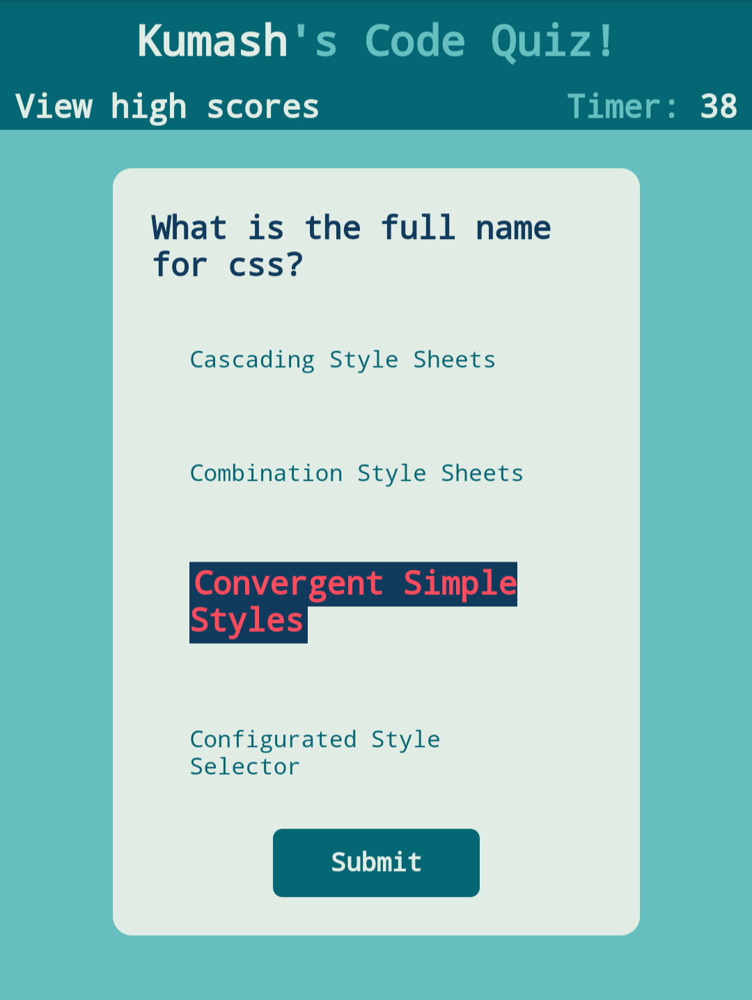

# [Code Quiz](https://logner.github.io/code-quiz)

This is the week 4 project from the University of Toronto SCS bootcamp. I have used native javascript, html and css. This was built from scratch.

Try it out and test your knowledge! 

There may be some unfair/incorrect questions. If there are, please let me know in the issues!!

as always- this is a responsive app!

